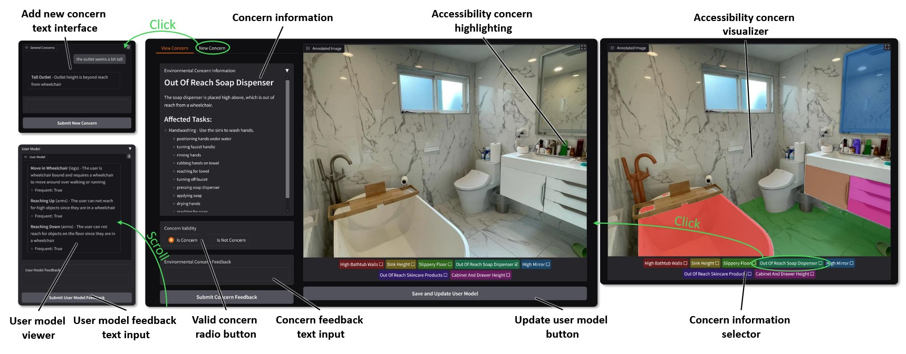

# Accessibility Scout: Personalized Accessibility Scans of Built Environments

### [[Project Page]]() [[DOI NOT AVAILABLE YET]]() [[arXiv]](https://www.arxiv.org/abs/2507.23190)


## Summary
- We introduce Accessibility Scout, an LLM-based personalized accessibility assessment system using images of built environments.
- Accessibility Scout consist of a human-AI collaborative LLM workflow which:
    - models user needs and preferences
    - breaks down and identifies potential tasks depicted in images
    - identifies accessibility concerns using task breakdowns and user models
    - updates the user model through user feedback on environment concerns
- We provide functionality for:
    - running the interactive demo in [```demo.py```](./demo.py)
    - Preprocessing all environmental images with semantic segmentation visual prompting and cached potential tasks in [```make_environments.py```](./make_environments.py) and [```make_baselines.py```](./make_baselines.py)
    - Creating user models in [```make_user_model.py```](./make_user_model.py)
    - Predicting accessibility concerns in [```predict_baselines.py```](./predict_baselines.py)

We provide all relevant code within this repo.

**If any code has any command line arguments, a user can run `python FILE.py -h` to see more information on potential command line options.**


## Installation

You can clone the repository with

```
git clone https://github.com/whuang37/accessibility-scout.git
```

All code was developed in **Python 3.10.8**. We give instructions on setting up dependencies below. We recommend using a virtual environment like [```uv```](https://docs.astral.sh/uv/) or ```virtualenv``` to install.

Using virtualenv:
```bash
cd
python -m venv .venv
. .venv/bin/activate

```

Install dependencies:

```bash
pip install -r requirements.txt
pip install torch torchvision torchaudio --index-url https://download.pytorch.org/whl/cu118 # CUDA 11.8. Install Torch based on your local machine
```

### Set Up Semantic-SAM:

Installing all dependencies:
```bash
cd ops && bash make.sh && cd ..
pip install git+https://github.com/UX-Decoder/Semantic-SAM.git@package

# fixing common errors
python -m pip install 'git+https://github.com/facebookresearch/detectron2.git'
```

Downloading the pretrained models:
```bash
mkdir ckpts/
bash scripts/download_ckpt.sh
```

### Setting up OpenAI
We use OpenAI for all LLM calls. In order to connect your OpenAI account, [create an API key](https://platform.openai.com/docs/quickstart/create-and-export-an-api-key) and enter the key into ```.env``` as seen in [```.env.example```](./.env.example)


## Getting Started
To test our demo, users should follow the following workflow to preprocess images and initiate the demo UI.

1. Organize all input images into individual folders for each environment. While our paper only analyzes one image per environment, we allow multiple images in each folder (this feature is untested).

2. Create all the environment masks using ```python make_environments.py --env-dir DIR_OF_ENV_DIRS --save-dir SAVE_DIR```. This is separated to allow users to cache preprocessing and lower inference time.

3. Create the initial user model JSON using ```python make_user_model.py --user-model-text PLAIN_TEXT_DESCRIPTION_OF_USER_CAPABILITIES --save-path SAVE_PATH```. If you do not want to initiate a user model, feel free to create an empty JSON instead.

4. Preprocess all the environments and cache potential tasks using ```python make_baselines.py --env-dir DIR_OF_PROCESSED_ENVIRONMENTS --save-dir SAVE_DIR --user-model-text PLAIN_TEXT_DESCRIPTION_OF_USER_CAPABILITIES```.

5. Start the demo UI using ```python demo.py --baseline-dir DIR_OF_PROCESSED_BASELINES --save-dir SAVE_DIR --user-model-path USER_MODEL_JSON_PATH```.

### Demo Usage
Upon starting the demo, you will be greeted with a simple UI to select which baseline to run, the save path where you want to save all identified accessibility annotations, and what user model ```.json``` to run. After selecting this, you will be greeted with the following UI.



View your user model on the bottom left of the screen. Check all predicted accessibility annotations on the right side image viewer. Check accessibility annotation information on the top left window.

# Citing
If extending or using our work, please cite our corresponding paper. The BibTex is as follows.

```
@misc{huangAccessibilityScoutPersonalized2025,
  title = {Accessibility {{Scout}}: {{Personalized Accessibility Scans}} of {{Built Environments}}},
  shorttitle = {Accessibility {{Scout}}},
  author = {Huang, William and Su, Xia and Froehlich, Jon E. and Zhang, Yang},
  year = {2025},
  month = jul,
  eprint = {2507.23190},
  primaryclass = {cs},
  doi = {10.1145/3746059.3747624},
  urldate = {2025-09-12},
  archiveprefix = {arXiv},
  copyright = {All rights reserved}
}

```
<<<<<<< HEAD
>>>>>>> 1dcd507 (updated demo to work with inputted folders)
=======
>>>>>>> 1dcd507 (updated demo to work with inputted folders)
