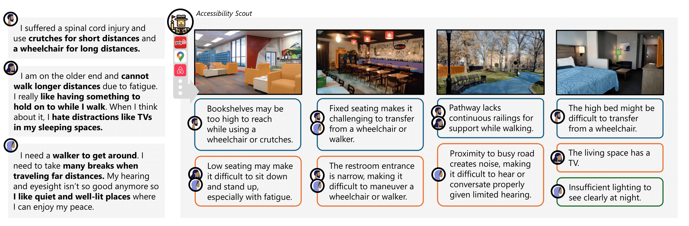

# Accessibility Scout: Personalized Accessibility Scans of Built Environments

### [[Project Page]]() [[DOI]]() [[arXiv]]()



## Summary
- We introduce Accessibility Scout, an LLM-based personalized accessibility assessment system using images of built environments.
- Accessibility Scout consist of a human-AI collaborative LLM workflow which:
    - models user needs and preferences
    - breaks down and identifies potential tasks depicted in images
    - identifies accessibility concerns using task breakdowns and user models
    - updates the user model through user feedback on environment concerns
- We provide functionality for:
    - running the interactive demo in [```demo.py```](./demo.py)
    - Preprocessing all environmental images with semantic segmentation visual prompting and cached potential tasks in [```make_environments.py```](./make_environments.py) and [```make_baselines.py```](./make_baselines.py)
    - Creating user models in [```make_user_model.py```](./make_user_model.py)
    - Predicting accessibility concerns in [```predict_baselines.py```](./predict_baselines.py)

We provide all relevant code within this repo.
**If any code has any command line arguments, a user can run `python FILE.py -h` to see more information on potential command line options.**


## Installation

You can clone the repository with

```
git clone
```

All code was developed in **Python 3.10.8**. We give instructions on setting up dependencies below. We recommend using a virtual environment like [```uv```](https://docs.astral.sh/uv/) or ```virtualenv``` to install.

Using virtual env:
```bash
cd
python -m venv .venv
. .venv/bin/activate

```

Install dependencies:

```bash
pip install -r requirements.txt
pip install torch torchvision torchaudio --index-url https://download.pytorch.org/whl/cu118 # CUDA 11.8. Install Torch based on your local machine
```

### Set Up Semantic-SAM:

Installing all dependencies:
```bash
cd ops && bash make.sh && cd ..
pip install git+https://github.com/UX-Decoder/Semantic-SAM.git@package

# fixing common errors
python -m pip install 'git+https://github.com/facebookresearch/detectron2.git'
```

Downloading the pretrained models:
```bash
mkdir ckpts/
bash scripts/download_ckpt.sh
```

### Setting up OpenAI
We use OpenAI for all LLM calls. In order to connect your OpenAI account, [create an API key](https://platform.openai.com/docs/quickstart/create-and-export-an-api-key) and enter the key into ```.env``` as seen in [```.env.example](./.env.example)

# Citing
If extending or using our work, please cite our corresponding paper found in the [DOI](). The BibTex is as follows.
